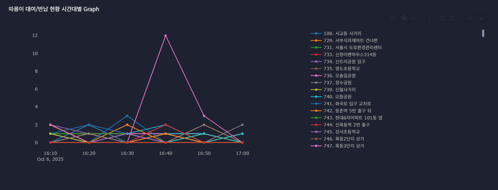

##  Bicycle Streaming (Integrated with `kafka-producer`)

`pyspark-apps/apps/bicycle`는 [`kafka-producer`](https://github.com/Pointsh/kafka-producer)의 **서울 따릉이 실시간 API** 파이프라인이 발행한 데이터를
**Kafka → Spark Structured Streaming → (S3/HDFS Sink, View)** 흐름으로 처리하는 스트리밍 JOB 모음입니다.

- 핵심 엔트리: `apps/bicycle/rt_bicycle_rent.py`
- 공통 베이스: `common/Inheritance/base_stream_app.py` (체크포인트/세션/로깅)
- 예제 유틸: `dataframe_checkpoint.py`, `dataframe_to_parameter.py`, `instance_variable.py`, `global_dataframe.py`
---
## 실시간 대여/반납 감지 로직 (Diff 기반 이벤트)
`kafka-producer`는 **전/현재 보관 대수의 차이(Δ)** 로 대여/반납 이벤트를 계산해 Kafka로 발행합니다.
`pyspark-apps`는 이 **가공된 이벤트 필드**를 그대로 소비하여 시간·지점별 집계를 수행합니다.

- Producer 계산 규칙
  - `diff = curr_cnt - prev_cnt`
  - `diff > 0` ⇒ `return_cnt = diff`, `rent_cnt = 0`
  - `diff < 0` ⇒ `rent_cnt = abs(diff)`, `return_cnt = 0`
  

- Streaming 소비 필드(예시):  
  `stt_id, stt_nm, rent_cnt, return_cnt, lst_prk_cnt, stt_lttd, stt_lgtd, crt_dttm`
- Spark 처리 흐름: **Kafka Source → from_json 파싱 → foreachBatch 집계/저장 → (S3/HDFS Sink, View/GlobalView)**
- Checkpoint: `self.kafka_offset_dir` (Exactly-Once 복원)
- Sink: Parquet 출력(예: `partitionBy("ymd","hh")`)로 Athena/대시보드 쿼리에 최적화
---
<p align="center">
  
</p>

<p align="center">
  
</p>

---

##  Upstream (from `kafka-producer`)

| 항목 | 값 |
|---|---|
| **Topic** | `apis.seouldata.rt-bicycle` |
| **Bootstrap servers** | `kafka01:9092,kafka02:9092,kafka03:9092` |
| **Payload (예시)** | `{"stt_id":"ST-1234","stt_nm":"강남역 1번 출구","tot_prk_cnt":20,"stt_lttd":"37.4979","stt_lgtd":"127.0276","crt_dttm":"2025-01-12 15:23:00"}` |

---

###  Prerequisites

- YARN/HDFS 기동: `start-dfs.sh && start-yarn.sh`
- Kafka Cluster 기동(브로커 3노드) 및 토픽 존재
- 네트워크: Spark ↔ Kafka 통신(9092), UI 포트(4040+/8088/8081) 허용
- AWS S3 Sink 사용 시: `hadoop-aws` + `fs.s3a.*` 자격 설정

---

###  Processing Flow

1. **Kafka Source** 로부터 `value`(JSON)를 수신  
2. `from_json`으로 스키마 파싱 → 필요한 필드/타입 정리  
3. **foreachBatch** 내부에서 마이크로배치 단위 가공/저장  
4. **Checkpoint**(HDFS 경로)로 오프셋/메타데이터 관리 → **재기동 시 정확히 한 번(Exactly-Once) 복원**

---

##  Kafka Source + JSON 파싱 (요약 코드)

```python
from pyspark.sql import functions as F, types as T

schema = T.StructType([
    T.StructField("stt_id", T.StringType()),
    T.StructField("stt_nm", T.StringType()),
    T.StructField("tot_prk_cnt", T.IntegerType()),
    T.StructField("stt_lttd", T.StringType()),
    T.StructField("stt_lgtd", T.StringType()),
    T.StructField("crt_dttm", T.StringType()),  # 필요 시 Timestamp로 캐스팅
])

kafka_df = (
    spark.readStream
         .format("kafka")
         .option("kafka.bootstrap.servers", "kafka01:9092,kafka02:9092,kafka03:9092")
         .option("subscribe", "apis.seouldata.rt-bicycle")
         .option("startingOffsets", "latest")
         .option("failOnDataLoss", "false")
         .load()
)

json_df = (
    kafka_df.selectExpr("CAST(value AS STRING) as value")
            .select(F.from_json("value", schema).alias("data"))
            .select("data.*")
            .withColumn("crt_ts", F.to_timestamp("crt_dttm", "yyyy-MM-dd HH:mm:ss"))
)
```
---
## foreachBatch 처리 + S3 Sink

`rt_bicycle_rent.py`는 Kafka에서 읽은 마이크로배치 데이터를  
배치 단위(`foreachBatch`)로 가공한 뒤 **S3 Data Lake**에 Parquet 포맷으로 적재합니다.


### foreachBatch 구현

```python
def _for_each_batch(self, df, epoch_id, spark):
    df.persist()
    cnt = df.count()
    self.logger.write_log("info", f"[epoch {epoch_id}] streaming rows: {cnt}")
    df.show(truncate=False)

    # S3 Sink: 실시간 데이터 Parquet 저장
    (
        df.write.mode("append")
          .partitionBy("ymd", "hh")
          .parquet("s3a://<PRIVATE_S3_PATH>/lesson/bicycle_rent_info/")
    )

    df.unpersist()

query = (
    json_df.writeStream
           .foreachBatch(lambda df, epoch_id: self._for_each_batch(df, epoch_id, spark))
           .option("checkpointLocation", self.kafka_offset_dir)
           .start()
)
query.awaitTermination()
```
---
## Checkpoint 경로

> **Checkpoint 경로:** `self.kafka_offset_dir`  
> (**BaseStreamApp**에서 관리되며, 기본값은 `/home/spark/kafka_offsets/rt_bicycle_rent`)  
> 재기동 시 이 경로를 통해 오프셋을 복원하므로 **Exactly-Once** 처리가 보장됩니다.

---

## 실행 예시

```bash
cd apps/bicycle
spark-submit \
  --master yarn \
  --deploy-mode cluster \
  rt_bicycle_rent.py
```
- **실행 모드:** YARN Client / Cluster 모두 지원 (`--deploy-mode`로 선택)  
- **로그 및 복원:** 체크포인트 재사용 시 중복 없이 이어서 스트리밍 수행  
---
### 모니터링 포인트

| 도구 | 경로/포트 | 설명 |
|------|------------|------|
| **Kafka-UI** | [http://\<host\>:8081](http://<host>:8081) | Topic / Partition / Consumer Group / Lag 확인 |
| **Spark UI** | [http://\<driver-host\>:4040](http://<driver-host>:4040) | Job / Stage / Task / DAG / Executor 상태 |
| **YARN UI** | [http://\<rm-host\>:8088](http://<rm-host>:8088) | Application 상태 및 로그 접근 |

---

### End-to-End 데이터 흐름

```text
[Seoul Open API]
   ↓
[kafka-producer] ──→ [Kafka: apis.seouldata.rt-bicycle]
                          ↓
[pyspark-apps: bicycle streaming]
   └── foreachBatch → S3 Parquet Sink
         ├─ Partition: ymd / hh
         └─ Path: s3a://<PRIVATE_S3_PATH>/lesson/bicycle_rent_info/
```
---
### 관련 스크립트 (apps/bicycle)

| 파일명 | 설명 |
|--------|------|
| `rt_bicycle_rent.py` | **Kafka → Spark Structured Streaming → S3 Parquet Sink** |
| `bicycle_main.py` | 엔트리 및 실행 진입점 |
| `dataframe_checkpoint.py` | DataFrame 체크포인트 관리 패턴 |
| `dataframe_to_parameter.py` | DataFrame을 함수 파라미터로 전달하는 예시 |
| `instance_variable.py` | 인스턴스 변수 기반 DataFrame 공유 패턴 |
| `global_dataframe.py` | GlobalTempView 기반 DataFrame 공유 |